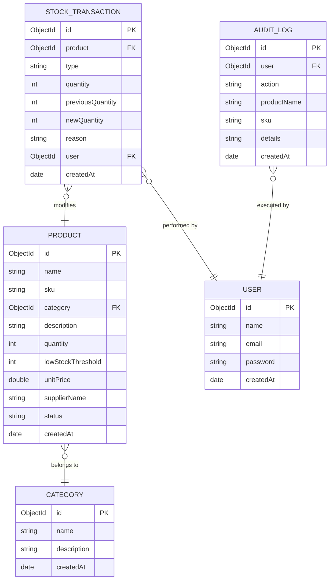

# InventoTrack - Inventory Management System

InventoTrack is a production-ready, full-stack inventory tracking portal designed with modern aesthetics (smooth dark/light mode switches, responsive grids, and visual status indicators) and high-value features.

## 🚀 Key Features
1. **Dynamic Change Audit Logs**: Track who, what, when, and how every item changed (creations, price adjustments, stock increments, and deletions) in a detailed activity tab.
2. **Rich Excel Exporter**: Download customized `.xlsx` spreadsheets styled with custom column widths, currency formatting, and locked read-only header rows (data rows remain editable for downstream use).
3. **Dynamic QR Code Generator**: Generate dynamic QR tags on the fly and open printer-friendly print tag layouts containing product SKU, price, and barcode parameters.
4. **Stock Transactions Ledger**: Record manual increments and decrements with execution notes and reasons linked to active staff sessions.

---

## 📁 Repository Structure
- `backend/`: Node.js + Express API server, MongoDB connection, Jest unit testing suites, and Swagger API specs.
- `frontend/`: Vite + React + Vanilla CSS UI views, Zustand store states, and React Query cache hooks.

---

## 📊 Database Schema (ER Diagram)

The following Mermaid diagram visualizes the collection schemas and relationships mapping categories, products, history transactions, and audit trails inside MongoDB:



---

## 🛠️ Getting Started & Setup

Follow these steps to configure your local workspace, database, and dev servers:

### 1. Configure Backend Environment
Create a `.env` file in the `backend/` directory using the sample variables:
```bash
cp backend/.env.example backend/.env
```

Define the configuration variables inside `backend/.env`:
```ini
PORT=5000
NODE_ENV=development
MONGODB_URI=mongodb://localhost:27017/inventro_track
JWT_SECRET=your-jwt-long-signing-secret-key-phrase
JWT_EXPIRES_IN=1h
REFRESH_TOKEN_SECRET=your-refresh-token-long-secret-key-phrase
REFRESH_TOKEN_EXPIRES_IN=7d
BCRYPT_SALT_ROUNDS=12
```

### 2. Install Project Dependencies
Run install at the repository root to fetch Node modules for both frontend and backend concurrently:
```bash
npm install
```

### 3. Seed Database
Execute the database seed script to clear collections and inject mock categories, products, and historic transaction logs:
```bash
npm run seed --prefix backend
```

### 4. Run Development Servers
Start both the React web application and the Express API server concurrently:
```bash
npm run dev
```
- **React Frontend View**: [http://localhost:8443](http://localhost:8443) (or the mapped dev port)
- **Express Backend API**: [http://localhost:5000](http://localhost:5000)

---

## 🔌 API Documentation (Swagger / OpenAPI)

The application mounts a dynamic Swagger UI API documentation view at startup. To explore routes, schemas, parameters, and execute sample requests:
1. Ensure the backend server is active (`npm run dev`).
2. Navigate to: **[http://localhost:5000/api-docs](http://localhost:5000/api-docs)**

### Key Endpoint Matrix

| Module | Method | Path | Description | Access Protection |
| :--- | :--- | :--- | :--- | :--- |
| **Auth** | `POST` | `/api/auth/register` | Register a new user account | Public |
| | `POST` | `/api/auth/login` | Login, returns session JWT token | Public |
| **Products**| `GET` | `/api/products` | Query products list (supports search, sort, pagination) | Authenticated |
| | `POST` | `/api/products` | Create a new product (creates Audit Log) | Authenticated |
| | `PUT` | `/api/products/:id` | Update product parameters (logs diff to Audit Log) | Authenticated |
| | `DELETE`| `/api/products/:id` | Delete product (creates Audit Log) | Authenticated |
| | `GET` | `/api/products/:id/qrcode`| Generate dynamic QR barcode tag string | Authenticated |
| | `GET` | `/api/products/export` | Export inventory as custom-styled Locked Excel sheet | Authenticated |
| **Categories**| `GET`| `/api/categories` | Fetch all category records | Authenticated |
| | `POST`| `/api/categories` | Create a new category | Authenticated |
| **Transactions**| `GET`| `/api/transactions` | Query history ledger of stock transactions | Authenticated |
| | `POST`| `/api/transactions/adjust/:id`| Record manually increased/decreased stock | Authenticated |
| **Audit Logs**| `GET`| `/api/audit-logs` | Retrieve chronological timeline of audit trails | Authenticated |

---

## 🧪 Automated Testing
Run backend unit and integration Jest tests:
```bash
npm run test --prefix backend
```
